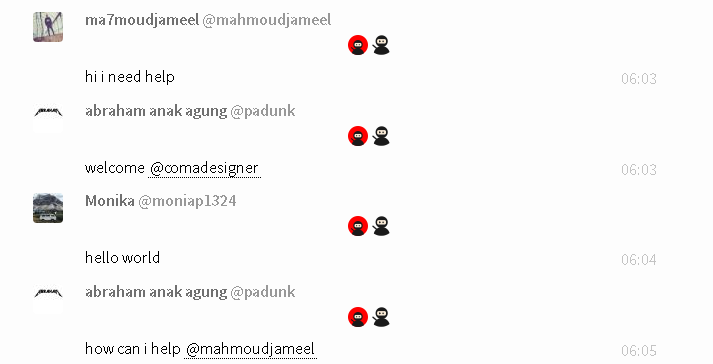

# Glitter-Gitter

Glitter gitter is a simple userscript that allows you to open someone's Free Code Camp profile by clicking their name.

## Getting started

### Install

Requires either [GreaseMonkey](https://addons.mozilla.org/en-US/firefox/addon/greasemonkey/) (FireFox) or [Tampermonkey](https://tampermonkey.net/) (Chrome, Opera, Safari, MSE).

You can use this [YouTube](https://www.youtube.com/watch?v=I1W2p6qLBUI) video or Google [installing userscripts](http://lmgtfy.com/?q=installing+userscripts).

Once you have it installed, go to the [chat](https://gitter.im/FreeCodeCamp/Help) and you will see ninjas - like the screenshot below!

Red Background Ninja - Uses the name without the @.

Non-Red Background Ninja - Uses the name with the @.

Why? Sometimes one won't work, but the other will. There isn't any definite way to tell which one won't land a 301 at this time.

# Better Content

Let me deliver you better content by dropping me a few tokens of appreciation.

BTC Addy: 18rQ5HzSwaFKvR54CCNhgq7eUDyN84X4Lu

# License

[MIT](https://opensource.org/licenses/GPL-3.0) © [navegacion](https://codepen.io/navegacion/)